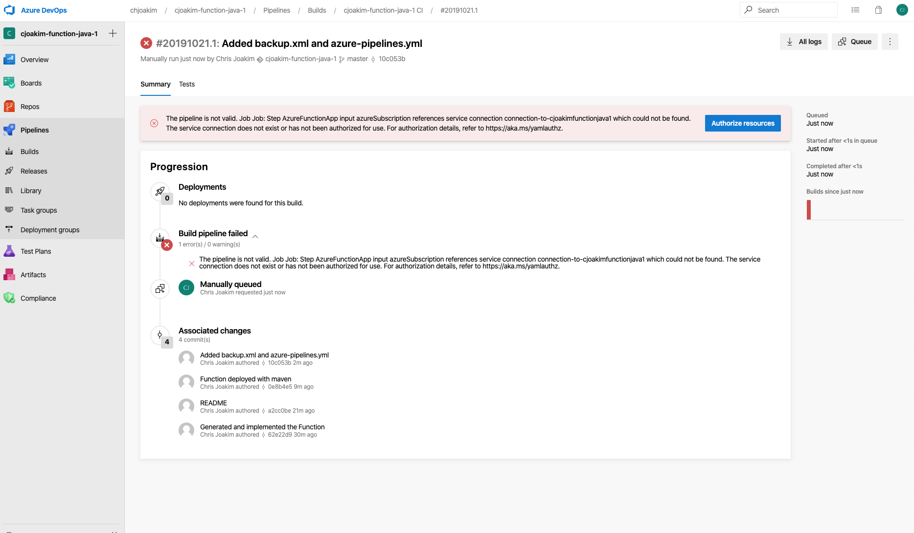

# Azure Functions - Java Function Creation, Testing, and DevOps

## Links

- https://docs.microsoft.com/en-us/azure/azure-functions/functions-create-first-java-maven
- https://docs.microsoft.com/en-us/azure/devops/pipelines/ecosystems/java-function?view=azure-devops

---

## Create a DevOps Project for your Function

### DevOps - Create Project 

Create a new DevOps project for your Function:


---

The Project is empty, but a repo is available:


---

Get the URL of the Azure DevOps Repo for your Project:


---

Clone the repo to your workstation:
```
$ git clone chjoakim@vs-ssh.visualstudio.com:v3/chjoakim/cjoakim-function-java-1/cjoakim-function-java-1
Cloning into 'cjoakim-function-java-1'...
warning: You appear to have cloned an empty repository.
```

---

## Create a Resource Group for your Function App

Create a resource group for your Java Functions; for example 'cjoakim-functions-java'.
The Azure CLI can be used to do this as follows:
```
$ az group create -l eastus -n cjoakim-functions-java
```

---

## Create the Java Function With Maven

Execute [create-function.sh](cjoakim-function-java-1/create-function.sh)
This uses **mvn archetype:generate** with artifact Id **azure-functions-archetype**.

```
mvn archetype:generate \
    -DarchetypeGroupId=com.microsoft.azure \
    -DarchetypeArtifactId=azure-functions-archetype \
    -DappName=$APP_NAME \
    -DappRegion=$REGION \
    -DresourceGroup=$RG \
    -DgroupId=com.$PKG.group \
    -DartifactId=$PKG.function \
    -Dpackage=$PKG
    -DinteractiveMode=false
```

Compile the Function like a typical Java/Maven project:
```
$ mvn clean package
```

Add the **javafaker** and **jackson** 3rd party libraries to the pom.xml to produce
random Addresses and return them as JSON.
```
    <dependency>
        <groupId>com.github.javafaker</groupId>
        <artifactId>javafaker</artifactId>
        <version>1.0.1</version>
    </dependency>

    <dependency>
        <groupId>com.fasterxml.jackson.core</groupId>
        <artifactId>jackson-core</artifactId>
        <version>2.9.6</version>
    </dependency>
    <dependency>
        <groupId>com.fasterxml.jackson.core</groupId>
        <artifactId>jackson-annotations</artifactId>
        <version>2.9.6</version>
    </dependency>
    <dependency>
        <groupId>com.fasterxml.jackson.core</groupId>
        <artifactId>jackson-databind</artifactId>
        <version>2.9.6</version>
    </dependency>
```

Edit [Function.java](cjoakim-function-java-1/src/main/java/com/cjoakim/functions/java1/Function.java)
to use the javafaker library.

## Testing Locally

Next, execute the Azure Function **locally on your development computer**.
The Azure Function runtime **requires Java 8**.
The script executes "mvn clean package" before launching the Function runtime.
```
$ ./run-local-function.sh
```

This script effectively just runs the following with Java 8:
```
mvn clean package
mvn azure-functions:run
```

[run-local-function.sh](cjoakim-function-java-1/run-local-function.sh)

It looks like this:
```
$ ./run-local-function.sh
...
[INFO] Azure Functions Core Tools found.

                  %%%%%%
                 %%%%%%
            @   %%%%%%    @
          @@   %%%%%%      @@
       @@@    %%%%%%%%%%%    @@@
     @@      %%%%%%%%%%        @@
       @@         %%%%       @@
         @@      %%%       @@
           @@    %%      @@
                %%
                %

Azure Functions Core Tools (2.7.1724 Commit hash: faf97bb64a53fbf1c7ef7e5c608c392c8662951b)
Function Runtime Version: 2.0.12763.0
Http Functions:
	HttpTrigger-Java: [GET,POST] http://localhost:7071/api/HttpTrigger-Java

Hosting environment: Development
Now listening on: http://0.0.0.0:7071
Application started. Press Ctrl+C to shut down.
```

In a separate shell, you can curl the locally running function:
```
$ curl http://localhost:7071/api/HttpTrigger-Java?type=address
{"result":"54977 Hermine Plaza, Weberview, Malta","type":"address"}
```

### Debugging Locally

[With **Visual Studio Code**](https://microsoft.github.io/AzureTipsAndTricks/blog/tip51.html)

---

## Deploy to Azure 

Use Maven to deploy your new Function to your Function App.  It does this by finding 
your Java Azure Function App within the **Resource Group** you specified in the create
step, which is included in the generated **pom.xml** file.

```
    <properties>
        <functionResourceGroup>cjoakim-functions-java</functionResourceGroup>
    </properties>
```

```
$ mvn azure-functions:deploy

[INFO] Scanning for projects...
[INFO]
[INFO] --< com.com.cjoakim.functions.java1.group:com.cjoakim.functions.java1.function >--
[INFO] Building Azure Java Functions 1.0-SNAPSHOT
[INFO] --------------------------------[ jar ]---------------------------------
[INFO]
[INFO] --- azure-functions-maven-plugin:1.3.4:deploy (default-cli) @ com.cjoakim.functions.java1.function ---
[WARNING] Azure Functions only support JDK 8, which is lower than local JDK version 11.0.4
[INFO] Authenticate with Azure CLI 2.0
[INFO] The specified function app does not exist. Creating a new function app...
[INFO] Set function worker runtime to java
[INFO] Successfully created the function app: cjoakimfunctionjava1
[INFO] Trying to deploy the function app...
[INFO] Trying to deploy artifact to cjoakimfunctionjava1...
[INFO] Successfully deployed the artifact to https://cjoakimfunctionjava1.azurewebsites.net
[INFO] Successfully deployed the function app at https://cjoakimfunctionjava1.azurewebsites.net
[INFO] ------------------------------------------------------------------------
[INFO] BUILD SUCCESS
[INFO] ------------------------------------------------------------------------
[INFO] Total time:  01:28 min
[INFO] Finished at: 2019-10-21T16:51:32-04:00
[INFO] ------------------------------------------------------------------------
```

Invoke the deployed Function with curl:
```
$ curl -v "https://cjoakimfunctionjava1.azurewebsites.net/api/HttpTrigger-Java?code=Re...==&type=address"
{"result":"1216 Dedra Ville, North Quincy, Uruguay","type":"address"}

With these headers:
HTTP/1.1 200 OK
Content-Type: application/json; charset=utf-8
```

---

## DevOps

Create file [azure-pipelines.yml](cjoakim-function-java-1/azure-pipelines.yml) in the root
directory of your Function.  However, the DevOps Pipeline is not created yet.
See https://docs.microsoft.com/en-us/azure/devops/pipelines/ecosystems/java-function?view=azure-devops

First, create a new DevOps pipeline per the following four screen shots:

Click 'New Pipeline'.


---

Select 'Azure Repos Git YAML'.


---

Select the Azure Repository.


---

Run the Pipeline, it should fail, because a **Service Connection** has not net been defined.


---

Define the **Service Connection** between your DevOps project and your Function App.  This
creates a Service Principal on your behalf.


Completed Service Connection.


The name of this Service Connection must be referenced in your **azure-pipelines.yml**
file, as follows:
```
variables:
  appName: cjoakimfunctionjava1
  serviceConnectionToAzure: connection-to-cjoakimfunctionjava1
```

Git changes to your **master branch** should now trigger the Pipeline.
