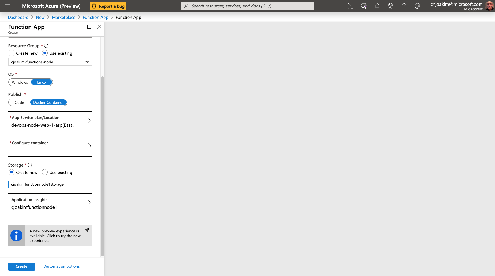
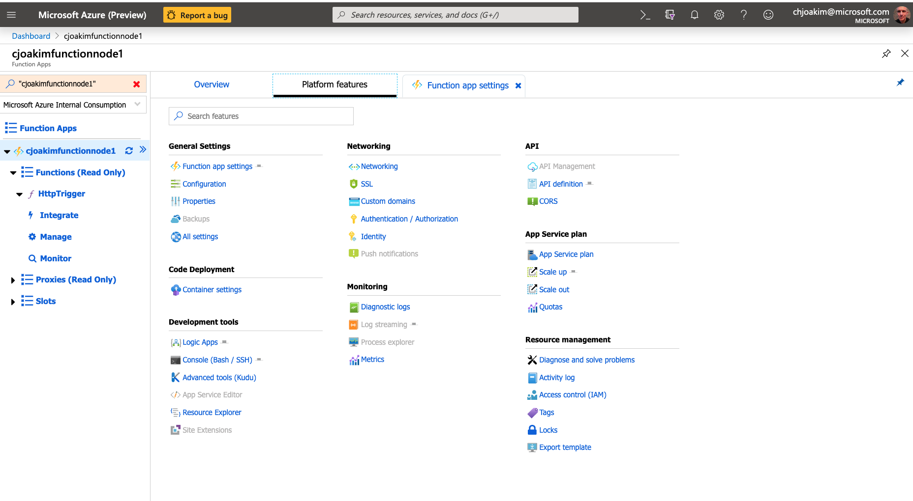

# Azure Functions - Node.js, Containers, and DevOps

## Links

- https://docs.microsoft.com/en-us/azure/azure-functions/functions-create-function-linux-custom-image?tabs=nodejs
- https://hub.docker.com/_/microsoft-azure-functions-node

---

## Create a DevOps Project for your Function

### DevOps - Create Project 

Create a new DevOps project for your JavaScript (Node.js) Function similarly as with
the [Java Function](java-function.md) in this repo.  DevOps project is named 
**cjoakim-function-node-1**.

Clone the repo to your workstation:
```
$ git clone git@ssh.dev.azure.com:v3/chjoakim/cjoakim-function-node-1/cjoakim-function-node-1
Cloning into 'cjoakim-function-node-1'...
warning: You appear to have cloned an empty repository.
```

---

## Create a Resource Group for your Function App

Create a resource group for your Java Functions; for example 'cjoakim-functions-java'.
The Azure CLI can be used to do this as follows:
```
$ az account list-locations

$ az group create -l eastus -n cjoakim-functions-node
```

---

## Create the Node.js Function Project, and Function

Use the **azure-functions-core-tools** to do this.

### Create the Function Project

A Project can contain several Functions, implemented in the same language.

These instructions are based on https://docs.microsoft.com/en-us/azure/azure-functions/functions-create-function-linux-custom-image?tabs=nodejs

Initialize the Functions Project:
```
$ func init FunctionProject1 --docker
Select a worker runtime:
1. dotnet
2. node
3. python
4. powershell
Choose option: 2
node

Select a Language:
1. javascript
2. typescript
Choose option: 1
javascript

Writing package.json
Writing .gitignore
Writing host.json
Writing local.settings.json
Writing /Users/cjoakim/github/cjoakim-function-node-1/FunctionProject1/.vscode/extensions.json
Writing Dockerfile
Writing .dockerignore
```

### Create a Function 

```
$ cd FunctionProject1

$ func new
Select a template:
1. Azure Blob Storage trigger
2. Azure Cosmos DB trigger
3. Durable Functions activity
4. Durable Functions HTTP starter
5. Durable Functions orchestrator
6. Azure Event Grid trigger
7. Azure Event Hub trigger
8. HTTP trigger
9. IoT Hub (Event Hub)
10. Azure Queue Storage trigger
11. SendGrid
12. Azure Service Bus Queue trigger
13. Azure Service Bus Topic trigger
14. Timer trigger
Choose option: 8

HTTP trigger
Function name: [HttpTrigger]

Writing /Users/cjoakim/github/cjoakim-function-node-1/FunctionProject1/HttpTrigger/index.js
Writing /Users/cjoakim/github/cjoakim-function-node-1/FunctionProject1/HttpTrigger/function.json
The function "HttpTrigger" was created successfully from the "HTTP trigger" template.
```

### Start the Function Runtime

In the FunctionProject1 directory, the parent directory of the HttpTrigger Function:
```
$ func start
```

Invoke the HttpTrigger Function with curl:
```
curl "http://localhost:7071/api/HttpTrigger?name=x"
Hello x
```

### Build and Execute the Docker Container Locally

```
$ docker build -t cjoakim/azurefunctionproject1 .

$ docker run -p 8080:80 -it cjoakim/azurefunctionproject1:latest
```

With your browser, visit URL **http://localhost:8080** and see that your Function App
is running:


Invoke the generated HttpTrigger with curl:
```
$ curl "http://localhost:8080/api/HttpTrigger?name=x"
HTTP/1.1 401 Unauthorized  <-- !!!
```

The reason for the HTTP 401 response is that your local Functions runtime is
running in 'Production' mode, per this logging in the container:
```
Hosting environment: Production
```

These are the bindings for your function in **HttpTrigger/function.json**.
If you change **authLevel** to **anonymous*** you should be able to test locally.
```
{
  "bindings": [
    {
      "authLevel": "function",
      "type": "httpTrigger",
      "direction": "in",
      "name": "req",
      "methods": [
        "get",
        "post"
      ]
    },
    {
      "type": "http",
      "direction": "out",
      "name": "res"
    }
  ]
}
```

This repo has a **build.sh** bash script that can build the container with either
file **function-azure.json** or **xxx**

```
$ ./build.sh local     <-- local allows the authLevel to be 'anonymous'

$ docker run -p 8080:80 -it cjoakim/azurefunctionproject1:latest

$ curl -v "http://localhost:8080/api/HttpTrigger?name=Y"
...
< HTTP/1.1 200 OK
...
Hello Y
```

---

## Create a Function App in Azure Portal

Named **cjoakimfunctionnode1** in resource group **cjoakim-functions-node**.
This process can also be executed in a scripted manner with the Azure CLI, 
PowerShell, or ARM templates.




### Test the Deployed Function

Get the URL of the Function, with it's authorization code.  Click the **Get Function URL** link
and copy the URL from the popup that appears.


```
$ curl -v "https://cjoakimfunctionnode1.azurewebsites.net/api/HttpTrigger?code=xfv...==&name=Miles"
...
< HTTP/1.1 200 OK
...
Hello Miles
```

The **authorization code can be regenerated** in this view:


### Configure for Continuous Deployment 

Set the Function App to use **continuous integration** with the underlying container image
in ACR.  

Function App --> Function app settings --> Platform Features --> Container Settings

Function App Main View; click 'Function app settings'.


Settings View; click the 'Platform Features' tab.


Platform Features View, click the 'Container Settings' link.



Container Settings View; click 'On' then 'Save'.


---

## Enhance the Function - add Azure Redis Cache functionality

### Enhancements:

- Add the npm **redis** library
- Have the Function **get** and **set** Azure Redis Cache keys
- Have the Function set HTTP headers and return **application/json**
- Have the Function read a **build_timestamp.json** file created by **grunt** at build time
- Intent is to show a non-trivial Azure Function implementation

Provision an **Azure Redis Cache service**, get its configuration values, and set the following
two **environment variables** on your local system and in the Azure Function App:
- AZURE_REDISCACHE_NAMESPACE
- AZURE_REDISCACHE_KEY


See the [index.js](cjoakim-function-node-1/FunctionProject1/HttpTrigger/index.js) Function code.

See the [function.json](cjoakim-function-node-1/FunctionProject1/HttpTrigger/function.json) configuration.

---

## DevOps - the final azure-pipelines.yml file

See the [azure-pipelines.yml](cjoakim-function-node-1/azure-pipelines.yml) build pipeline.

---

## Invoke the Azure Function with curl

```
$ curl "https://cjoakimfunctionnode1.azurewebsites.net/api/HttpTrigger?code=Twa...==&operation=set&key=city&value=Raleigh" | jq

{
  "date": "Wed, 23 Oct 2019 15:47:39 GMT",
  "build": {
    "build_user": "vsts",
    "build_timestamp": "Wed, 23 Oct 2019 15:10:22 GMT",
    "build_epoch": 1571843422725
  },
  "key": "city",
  "operation": "set",
  "value": "Raleigh",
  "reply": "OK"
}
```

```
$ curl "https://cjoakimfunctionnode1.azurewebsites.net/api/HttpTrigger?code=Twa...==&operation=get&key=city" | jq

{
  "date": "Wed, 23 Oct 2019 15:49:27 GMT",
  "build": {
    "build_user": "vsts",
    "build_timestamp": "Wed, 23 Oct 2019 15:10:22 GMT",
    "build_epoch": 1571843422725
  },
  "key": "city",
  "operation": "get",
  "reply": "Raleigh"
}
```
